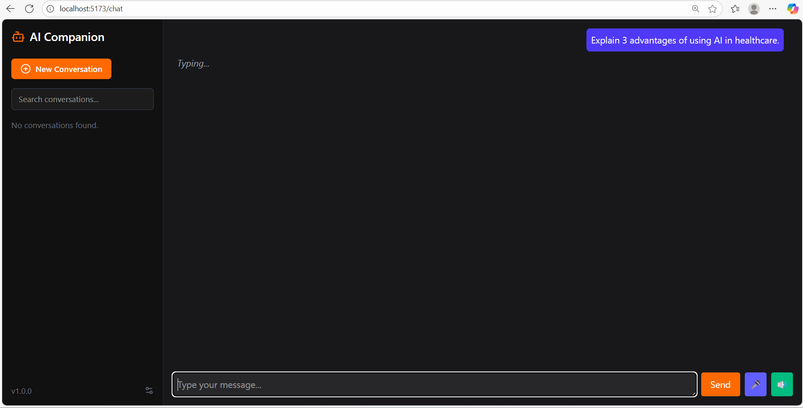
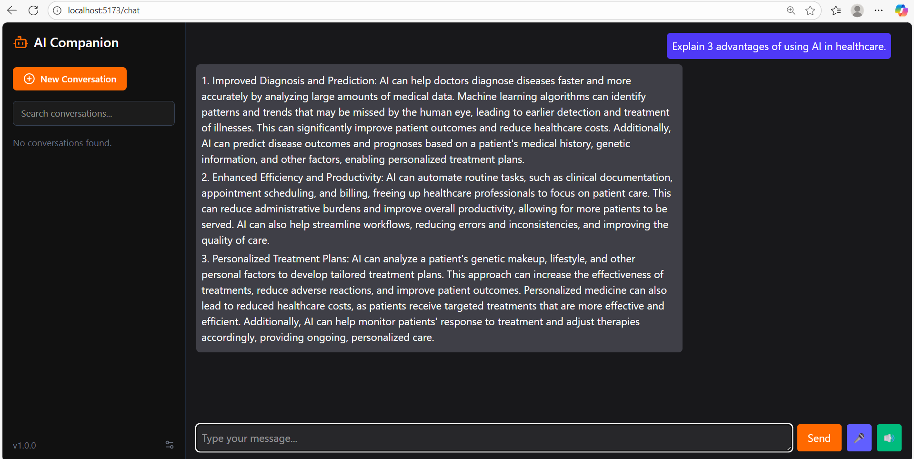

#  AI Conversational Chatbot

A full-stack conversational AI chatbot built using React, Node.js, MongoDB, and OpenRouter (ChatGPT API). The chatbot supports real-time conversation, voice input/output, typing loader, and saves chat history in MongoDB.

## Features

-  Real-time conversational AI (OpenRouter / ChatGPT)
-  Voice-to-Text (mic input using Web Speech API)
-  Text-to-Speech (audio output)
-  "Typing..." loader animation
-  Chat history saved in MongoDB
-  Sidebar with previous conversations
-  Auto-scroll on new messages
-  New Conversation creation
-  Clean dark mode UI with Tailwind CSS + Lucide Icons

## Folder Structure
/client → Frontend React app
└── components/
└── ChatWindow.jsx
└── InputBox.jsx
└── Sidebar.jsx
└── pages/
└── ChatPage.jsx
└── App.jsx
└── main.jsx

## /server → Backend Node.js + Express app
└── controllers/
└── chatController.js
└── models/
└── chatModel.js
└── routes/
└── chatRoutes.js
└── server.js
└── .env ( ignored)

## 🔧 Installation
### 1. Clone the Repository
- git clone https://github.com/your-username/ai-chatbot.git
- cd ai-chatbot

# 2. Setup Backend
- cd server
- npm install

Create a .env file inside /server:
- PORT=Your Port 
- MONGO_URI=your MongoDB URI
- OPENROUTER_API_KEY=your_openrouter_api_key

Start the backend:
- nodemon server.js

3. Setup Frontend
cd client
npm install
npm run dev

### Technologies Used
-  React.js
-  Tailwind CSS
-  Framer Motion
-  Lucide-react Icons
-  Node.js
-  Express.js
-  MongoDB + Mongoose
-  Axios
-  Web Speech API
-  OpenRouter (ChatGPT models)

### AI Chat Interface

### Voice Input Feature

### Chat History in Sidebar

License
MIT License © 2025

Developed by:
- Ravikumar N K
- Acharya Institute Of Technology, Bangalore 
- Email:nkravikumar18@gmail.com
- Contact:7483173215

